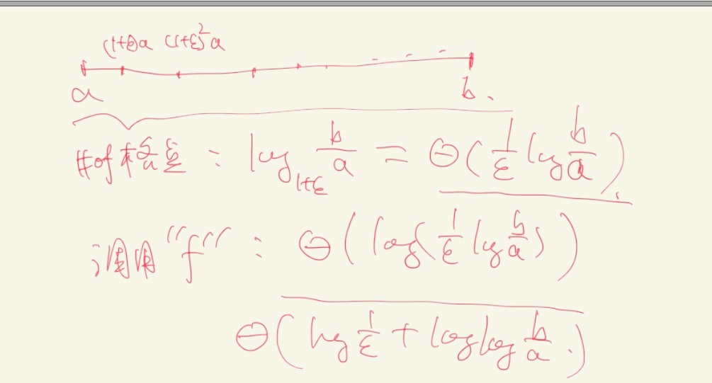
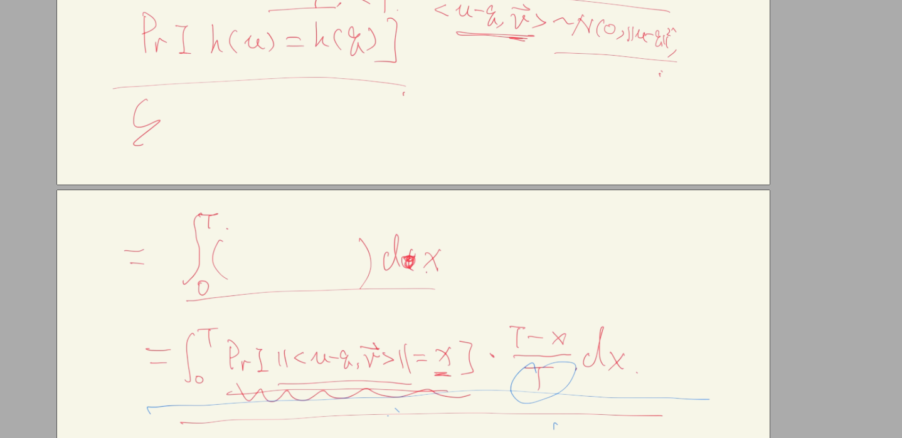

## Near Neighbor Search

可用于快速的近邻查询
其他方法有
- KD-tree
- Quad Tree
- ...

**目录**

[toc]

### Background

#### NNS(Nearest Neighbor Search)

给定点集 $P\subseteq R^d$, 以及一个查询点 $q$, 返回 $P$ 中离 $q$ 最近的点:
$$dist(q, P)=\min\{\|p-q\|\big|p\in P\}$$

##### 一维(d=1)

sorting + binary search
using BST...

O(n)

##### 二维(d=2)

若 $d = \Theta(1)$, 使用 KD-Tree, Quad-Tree 能做到 $\Theta(\log^d n)$ 的 query 时间复杂度

但若 d 非常大, 如果使用 JL-transform, $d\rightarrow\Theta(\frac{\log n}{\epsilon^2})$, 时间复杂度则是 $\Theta(\log^{O(\frac{\log n}{\epsilon^2})}n)$, 是不可接受的指数级.

#### Near Neighbor Search

问题抽象为: $NNbr(P,r), r>0$. 即给定 $P$, $r>0$, $q\in\mathbb{R}^d$, 返回
$$\left\{\begin{array}{ll}"yes" 和\ p' & ,if\ \exists dist(q,p')\le r \\ "no" &, otherwise\end{array}\right.$$

假设有算法 f 可以解决上述问题, 同时我们知道 $a\le dist(q, P)\le b$, 
要想达到 $$\|q-p'\|\le(1+\epsilon)\cdot dist(q,P)$$, 那么需要调用 `f` 多少次？

以格点为划分方法 "二分" 查找(乘法的二分)

#### 近似 Near Neighbor Search(近似 NNbr)

$NNbr_\approx(P, r, R)$ (其中$r<R$), 使得
1. 若 $dist(q,p)\le r$, 返回 p', s.t. $\|q-p'\|\le R$
2. 若 $dist(q,p)>R$, 返回 " $dist(q,p)> r$ "
3. 否则 $r< dist(q,p)\le R$, 返回 (1) 或 (2) 均可

### LSH

#### Some Prerequisites

##### $(r,R,\alpha,\beta)$—sensitive

$(r,R,\alpha,\beta)$—sensitive ($r< R, 1>\alpha>\beta>0$): 如果对于 $\forall u,q\in R^d$, 从 $F$ 中随机抽取一个 $h$,
1. 若 $\|u-q\|\le r$, $Pr[ h(u)=h(q) ] \ge \alpha$
2. 若 $\|u-q\|> R$, $Pr[ h(u) = h(q) ] \le \beta$

即点越近$\le r$, 哈希值相等概率越高$\ge\alpha$; 点越远($>R$), 哈希值相等概率越小($\ge\beta$)

##### 哈希函数族 F
$F=\{h|h: R^d\rightarrow Z^+\}$ 是一族局部敏感的哈希函数:
- 例如: 给定 $T>0$, 取 $v\sim N^d(0,1)$, 随机从 $[0, T]$ 中取 t, 则可构造$$h(p)=\lfloor\frac{\left< p,v \right> + t}{T}\rfloor$$

-----
**性质的证明？**

-----

<!-- ##### 一个定理

给定 $r,\epsilon\in (0,1)$, $\exists T\ge 0$, s.t. $F$ 是 $(r,(1+\epsilon)r, \alpha,\beta)$-sensitive 的, 其中
$$\frac{\log(1/\alpha)}{\log(1/\beta)}\le\frac{1}{1+\epsilon}$$

(因为 $\beta<\alpha$, 不等式左边一定$\le 1$) -->

#### 构造 LSH 

若 $F$ 是 $(r,(1+\epsilon)r, \alpha,\beta)$-sensitive 的, 给定参数 $k, \tau\in Z^+$, 
令 $G(F,k)=\{\left.g_i=(h_1,h_2,\cdots,h_k)\right|h_i随机取于 F\}$
(则每个 $g_i$ 也是一个哈希函数, $R^d\rightarrow R^k$)

从 $G(F,k)$ 中随机取 $g_1,\cdots,g_\tau$ 构成 LSH, 则一个 $R^d$ 的数据经过 $(g_1,\cdots,g_\tau)$ 映射成 $\tau$ 列 $R^k$ 的列向量.

若输入 $P\subset R^d, |P|=n$, 则有**定理**:
假设 F 是一个满足 $\rho=\frac{\log(1/\alpha)}{\log(1/\beta)}\le\frac{1}{1+\epsilon}$ 的 $(r,(1+\epsilon)r, \alpha,\beta)$-sensitive 的哈希函数族, 
令 $k=\log_{\frac{1}{\beta}}n=\frac{\log n}{\log \frac{1}{\beta}}$, $\tau=2\cdot n^\rho$

可以建立 Hash 表 $H_1,\cdots,H_\tau \in R^{k\times n}$, 其中 $H_i$ 的每一列是相应原数据经过 $g_i$ 映射的列向量结果. 则对于 $\forall$ 查询点 $q\in R^d$, 以下两个事件同时为真的**概率$\ge\frac{3}{5}$**:
1. 若 $\exists u\in P$, $\|u-q\|\le r$, 则 $\exists 1\le j \le \tau$, s.t. $g_j(u)=g_j(q)$
2. 若 $\forall u\in P$, $\|u-q\| > (1+\epsilon)r$, 则和 $q$ 发生碰撞的点的个数 $\le 4\tau$

##### 证明:

1. 由于 $\|u-q\|\le r$, 因此 $Pr[g(u)=g(q)]\ge\alpha^k=n^{-\rho}$ (经哈希映射 $g$ 后的每个元素(k个)都要相同), 
因此 $Pr[H_1\cdots H_\tau 至少有一个发生了碰撞]\ge 1-(1-n^{-\rho})^\tau\ge1-\frac{1}{e^2}>\frac{4}{5}$
2. 由于 $\|u-q\| > (1+\epsilon)r$, 故 $Pr[g(u)=g(q)]\le \beta^k =\frac{1}{n}$, 
因此 $\forall H_i, E[\sharp 碰撞]\le 1$, 
进而$E[\sharp碰撞\ in\  H_1, \cdots, H_\tau]\le \tau$, 
从而 $Pr[\sharp总碰撞\le4\tau ]=1-Pr\left[\sharp总碰撞>4\tau\ge E[\sharp总碰撞]\right]\ge 1-\frac{1}{4}=\frac{3}{4}$

因此两个事件均为真的概率至少是 $\frac{4}{5}\times\frac{3}{4}=\frac{3}{5}$ $\square$

#### 根据 $H_1,\cdots,H_\tau$ 查询

对于给定的 $q$, 将 $q$ 映射到 $H_1,\cdots,H_\tau$, 只检查前 $\le 4\tau+1$ 个碰撞(可能不到)
1. 若 $\exists$ 碰撞 $u$, s.t. $\|u-q\| \le (1+\epsilon)r$, 则返回 $u$ 以及 "$dist(q,P)\le (1+\epsilon)r$"
2. 若前 $4\tau + 1$ 个碰撞点均 $>(1+\epsilon)r$, 则返回 $dist(q,P)\ge r$, 
   
三种情况:
1. $dist(q,P)>(1+\epsilon)r$, 返回 $dist(q,P)\ge r$ 
2. $dist(q,P)\le r$, 检查的 $4\tau + 1$ 个点中只要存在一个 s.t. $\|u-q\|\le(1+\epsilon)r$, 就能返回 "$dist(q,P)\le (1+\epsilon)r$"
3. $r < dist(q,P) \le (1+\epsilon)r$, 则若
    - 有 $\ge 4\tau +1$ 个碰撞, 返回 "$dist(q,P)\le (1+\epsilon)r$"
    - 若 $\le 4\tau$ 个碰撞, 返回 "$dist(q,P) > r$"
 
#### LSH 的复杂度分析

##### 空间

$\Theta(dn + \tau n k)=\Theta(dn + n^{1+\rho} n k)$

其中 $dn$ 是原数据 $P$, $\tau n k$ 是 $H_1,\cdots, H_\tau$ 的表存储, 每个表要有 $n\times k$, 如 $H_1$ 的第 i 行的 k 列表示原始第 $i$ 个数据 $P_i$ 经过 $g_1=(h_{11},\cdots,h_{1k})$ 映射的结果.

##### 建表

$\Theta(\tau nkd)$

##### 查询

$\Theta(\tau k d + (4\tau + 1) d)$

先用 $\Theta(\tau k d)$ 算出 $q$ 的哈希结果, 而后做 $4\tau + 1$ 次比较.

$\Theta(\tau k d + (4\tau + 1) d)=\Theta(n^\rho \log n d+n^\rho d)=\Theta(n^{\frac{1}{1+\epsilon}}\log n d) < nd$ 

### Vector Quantization and Production Quantization

考虑 [k-means](./8.cluster.md#connection-to-assignment-based-cluster) 问题, 对于 $\forall q \in R^d$, 要返回 $\{c_1,\cdots,c_k\}$ 中最近的点, 空间和时间复杂度均为 $\Theta(kd)$.

VQ 在这里则指的是 k-means 算法本身, 它能够找到 $k$ 个类中心来近似整个数据集 P.

为了降低 VQ 的查询误差, 可以把 VQ 转化为 PQ

1. 对 $R^d$ 划分为 $R^d \rightarrow R^{d/m} \times\cdots\times R^{d/m}$
2. 对于每一个 $R^{d/m}$, 分别做 k-means, 得到 $C_i=\{c_1^i, \cdots, c_k^i\},\ i=1,\cdots,m$ 
3. 建立 $C_1\times\cdots\times C_m$
4. $\forall u\in P$, 在每一个 $C_i$ 上找最近点都能得到一个值, 合起来就是映射到一个 $R^m$. 依据这个想法, 可以构建 
    - **Table I**: 为 $m\times n$ 的表, 每列是原数据的映射结果
    - **Table II**: 为 $m\times C_k^2$ 的表, 表示类中心的距离.
5. **查询**: 
   1. 对 $q\in R^d$, 在各个 $C_i$ 中找最近点, 从而 $q$ 映射到 $v_q=[c_q^1, \cdots, c_q^m]^T \in R^m$
   2. 对 $\forall u \in P$, 从 **Table I** 查得 $v_u=[c_u^1,\cdots, c_u^m]^T \in R^m$. 
   3. 则 $\|u-q\| \approx \sum\limits_{i=1}^m\|c_u^i - c_q^i\|^2$, 查 **Table 2** 即可快速完成.

其 **空间复杂度** 为 $\Theta(mk\frac{d}{m}+mn+mk^2)=\Theta(n+d)$. 其中,
- $\Theta(mk\frac{d}{m})$ 是 m 个 $C_i$ 的 $k$ 个中心, 每个中心点需要 $\frac{d}{m}$ 的大小来存储.
- $mn$ 为 **Table I** 所需, $mk^2$ 为 **Table II** 所需.

其 **时间复杂度** 为 $\Theta(m\frac{d}{m}k+nm)=\Theta(n + d)\le\Theta(nd)$, 其中,
- $\Theta(mk\frac{d}{m})$ 是 $q$ 要在 $m$ 个 $C_i$ 中都找最近点, 每次找要 $k\frac{d}{m}$
- $\Theta(mn)$ 是对于 $n$ 个点都要算一次 $\|u-q\|$ 的近似值(上述查询第 3 步), 每次计算要 $\Theta(m)$

