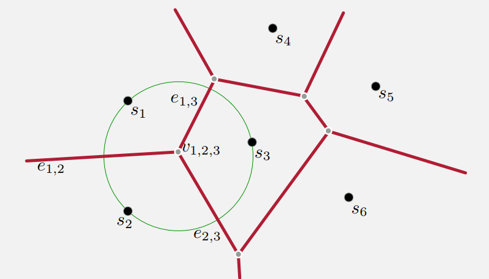

## Cluster

[toc]

### Voronoi Diagrams

给定点集 $S=\{s_1,s_2,\cdots,s_k\}\subset R^d$, 考虑如何划分 $R^d$ 这个空间 (邮局问题).

Voronoi Diagrams 将 $R_d$ 划分为 $k$ 个区域, 满足
$$R_i=\{x\in R^d | \phi_S(x)=s_i\}$$
其中$$\phi_S(x)=\arg\min\limits_{s_i\in S}\|x-s_i\|$$

#### Voronoi edges and verices

以下讨论在 $R^2$ 中进行.

- Voronoi Edges: 是两个区域的边界, 以一条线或线段表示.
  - $e_{i,j}=\{x\in R^2|\|x-s_i\|=\|x-s_\|\le\|x-s_l\|, \forall l\not=i,j\}$
- Voronoi Vertices: 到三个 site 距离恰好相等
  - $v_{i,j,l}=\{x\in R^2|\|x-s_i\|=\|x-s_i\|=\|x-s_l\|\le\|x-s_k\|, \forall k\not=i,j,l\}$

<table style='width:70%; text-align:center; margin:auto'><tr><td>
</img>
voronoi-diagram
</td></tr></table>

由于这样的划分是一个 `平面图`, 根据欧拉公式, 对于 n 个 vertices, m 条 edges, k 个 faces 有:
$$k+n-m=2$$

但对于 $R^d$, 复杂度(边点面个数)约为 $k^{\lceil d/2\rceil}$

#### Delaunay Triangulation

转换关系

| Voronoi Diagram | Delaunay Triangulation |
|:-:|:-:|
|face $R_i$|vertex $s_i$|
|vertex $v_{i,j,l}$|triangle face $f_{i,j,l}$|
|edge $e_{i,j}$|edge $\bar{e}_{i,j}$|

<table style='width:70%; text-align:center; margin:auto'><tr><td>
</img>
delaunay triangulation diagram
</td></tr></table>

其特点是: 
- 所有的 triangulation 中, 最大化所有三角形中最小角的 triangulation.
- circle property(P156, **看不懂**)

#### Connection to Assignment-based Cluster

Assignment-based Cluster:
给定点集 X, 距离 $\mathbf{d}: X\times X\rightarrow \mathbb{R}_+$, 输出点集 $S=\{s_1,\cdots,s_k\}$ 使得

- k-means: $$\mathrm{minimize} \sum\limits_{x\in X}\mathbf{d}(\phi_S(x),x)^2$$
- k-center: $$\mathrm{minimize} \max_{x\in X}\mathbf{d}(\phi_S(x),x)$$
- k-median: $$\mathrm{minimize} \sum\limits_{x\in X}\mathbf{d}(\phi_S(x),x)$$
  - 直观上相当于拿几个球包住所有点, 要求半径最小(**Minimun Enclosing Ball, MEB**)

### Gonzalez Algorithm for k-center Cluster

**思路**: 每次选离各自类中心(site)最远的点

#### 近似比为 2 的证明

即:
$$\max_{x\in X}\mathbf{d}(\phi_{\hat{S}}(x),x) \le 2\max_{x\in X}\mathbf{d}(\phi_{S^*}(x),x)$$

**证明**如下:

假设 $A_1,\cdots,A_k$ 是最优的 $k$ 个类, $P=\bigcup\limits_{j=1}^k A_j$, 对应 k 个类中心 $\{a_1,\cdots,a_k\}$, 其中有 $A_j\subset B(a_j,r_{opt})$

令 $C=\{c_1,\cdots,c_k\}$ 是 Gouzalez 算法的输出结果.

- 若其恰好分别落在 $A_1,\cdots,A_k$ 里, 不妨设为 $c_1\in A_1,\cdots,c_k\in A_k$, 则由三角不等式可知
$$P\subset \bigcup\limits_{j=1}^kB(c_j,2r_{opt})$$
- 若 $\exists c_j, c_{j'}\in A_l$, 可设 $c_1\in A_1,\cdots,c_i\in A_i, c_{i+1}\in A_t, 1\le t\le i$
  - (a). 
      $$\|c_{i+1}-c_t\|\ge \min\limits_{1\le j\le i}\|c_{i+1}-c_j\|$$
  - (b). 每次取最远的:
    $$\min\limits_{1\le j \le i}\|c_{i+1}-c_j\| \ge \max\limits_{p\in\bigcup\limits_{j=i+1}^k A_j}\{\min\limits_{1\le j \le i}\|p-c_j\|\}$$
  - (c). $c_{i+1}$ 和 $c_t$ 共属于一个 $A_t$:
    $$\|c_{i+1}-c_t\|\le r_{opt}$$

(a) + (b) + (c) 即得
$$\max\limits_{p\in\bigcup\limits_{j=i+1}^k A_j}\{\min\limits_{1\le j \le i}\|p-c_j\|\}\le 2r_{opt}$$

$\Rightarrow$$$\max\limits_{p\in P}\{\min\limits_{1\le j\le i}\|p-c_j\|\}\le 2r_{opt}$$

#### 算法, 实现 和 复杂度分析

**算法**:
<table style='width:70%; text-align:center; margin:auto'><tr><td>
</img>
Gonzalez Algorithm
</td></tr></table>

**实现**: 维护一个表以记录各个点到其最近 site 的距离$\phi[x]$. 每轮迭代中, 用 $\Theta(nd)$ 时间检查挑选出结果, 而后再用 $\Theta(nd)$ 更新 $\phi[j]$

**复杂度**: $\Theta(knd)$
 
#### 分布式情况

将 $P$ 分解为 $P=P_1\cup P_2\cup \cdots\cup P_T$, 由 Gonzalez 各自得到 sites $C_t=\{c^t_1,\cdots,c^t_k\}$; 再对这些 sites 做 Gonzales, 再得到 $\widetilde{C}=\{\widetilde{c}_1,\cdots,\widetilde{c}_k\}$

该算法是 **4-approx** 的.

- 本地 Gonzalez 得到 $P_t\subset \bigcup\limits_{j=1}^k B(c_j^t,2r_{opt})$
- 中心服务器则有 $\bigcup\limits_{t=1}^TC_t\subseteq\bigcup\limits_{j=1}^kB(\widetilde{c}_j,2r_{opt})$

故 $P=\bigcup\limits_{t=1}^T P_t\subseteq B(\widetilde{c}_j, 4r_{opt})$

### Lloyd Algorithm for k-means Cluster

#### 算法 和 复杂度

<table style='width:100%; text-align:center; margin:auto'><tr><td>
</img>
Lloyd Algorithm
</td></tr></table>

设迭代次数是 $N$, 则 d 维 n 数据 k-means 的 Lloyd 算法, $O(kd)$ 更新一个数据点的中心, 所以总时间复杂度是 $O(Nnkd)$

#### 性质

不保证质量, 可以无限差(考虑一个很长的矩形的四个顶点)

#### k-means++

##### Motivation

若已知最优 cluster: $A_1,\cdots,A_k$, 从每个 $A_j$ 中随机取点为 $c_j$ 作为 k 个类中心, 考虑其**期望近似比**如何?

$$
\begin{align*}
&\quad E\left(\sum\limits_{\rho\in A_1}\|p-c_1\|^2\right) \\
&=\frac{1}{A_1}\sum\limits_{q\in A_1}\sum\limits_{p\in A_1}\|p-q\|^2 \\
&=\frac{1}{A_1}\sum\limits_{q\in A_1}\sum\limits_{p\in A_1}(\|p-u(A_1)\|^2+2\left<p-u(A_1), u(A_1)-q\right>+\|u(A_1)-q\|^2) \\
&=2\sum\limits_{p\in A_1}\|p-u(A_1)\|^2
\end{align*}
$$

故期望近似比为 2.

由 Markov 不等式: $\forall \eta\in(0,1), P(近似比\le 2\cdot \frac{1}{\eta})=1-\eta$

##### Details

亦称 $D^2-sampling$ 算法, 类似 Gonzalez 算法, 但每个点被选中的概率是
$$\frac{D(p,C)^2}{\sum\limits_{q\in P}D(q,C)^2}$$
其中 $D(q,C)=\min\{\|q-c_i\||1\le i \le j-1\}$
<table style='width:100%; text-align:center; margin:auto'><tr><td>
</img>
k-means++ Algorithm
</td></tr></table>

**近似比期望**: $\le8\log k$

**时间复杂度**: $\Theta(knd)$

### Cluster on Graph

#### Max-cut for 2-clustering

**目标**: 找到关于 V 的一个划分 $S$ 和 $V\backslash S$ 使得
$$\mathtt{maximize}\ w(S,V\backslash S)=\sum\limits_{i\in S,j\in V\backslash S} w_{ij}$$

##### 半正定规划(SDP, SemiDefinite Programming)

- 目标函数: $\sum\limits_i\sum\limits_j\alpha_{ij}x_{ij}$
- 约束: 
$$
\begin{array}{l}
A\left[\begin{array}{c}x_{11} \\ \vdots \\ x_{nn}\end{array}\right]\le b \\
\\
X 是 SD\ matrix, 即 X\succeq 0
\end{array}
$$

(半正定: 满足 $\forall y \in \mathbb{R}^n, y^TXy\ge 0$ 的对称矩阵 $X$)

##### Max-cut $\Rightarrow$ SDP

定义变量 $y_i=\left\{\begin{array}{ll}
+1 & if\ i\in S \\
-1 & if\ i\notin S
\end{array}\right.$

则目标函数为 $\mathtt{maximize}\ \frac{1}{2}\sum\limits_{i < j}w_{ij}(1-y_iy_j)$

可以放松 $y_i$ 到 $v_i\in S_n$, 其中 $S_n$ 是 $n$ 维空间的球面

从而目标函数变为 $\mathtt{maximize}\ \frac{1}{2}\sum\limits_{i < j}w_{ij}(1-\left<v_i,v_j\right>)=\frac{1}{2}\sum\limits_{i < j}w_{ij}(1-x_{ij})$
满足
$$
\begin{array}{l}
\forall i, x_{ii} = 1\\
\\
X=\left[\begin{array}{ccc}
x_{11} & \cdots & x_{1n} \\
\vdots &        & \vdots \\
x_{n1} & \cdots & x_{nn} 
\end{array}\right]
=\left[\begin{array}{c}v_1^T \\ \vdots \\ v_n^T \end{array}\right] \cdot \left[v_1, \cdots, v_n \right]
\succeq 0
\end{array}
$$

##### 算法

1. 利用 SDP 算法求解上式, 得到 X. 通过分解 X （Cholesky 分解)得到 $\{v_1,\cdots,v_k\}\subseteq S_n$
2. 在 $S_n$ 随机取向量 $r$
3. 令 $S=\{i|\left<v_i,r\right>\ge 0\}$, $V\backslash S=\{i|\left<v_i,r\right>< 0\}$

##### 近似比证明

证明其能达到小于 1 的近似比.

$$\begin{align*}
&\quad Pr[sgn(\left<v_i,r\right>\not= sgn(\left<v_j,r\right>)] \\
&=\frac{2\theta}{2\pi} = \frac{2\arccos(\left<v_i,v_j\right>)}{2\pi}=\frac{\arccos(\left<v_i,v_j\right>)}{\pi} \\
\end{align*}$$

因此 
$$\begin{align*}
&\quad E[w(S,V\backslash S)] \\
&=\sum\limits_{i<j}w_{ij}\cdot Pr[sgn(\left<v_i,r\right>\not= sgn(\left<v_j,r\right>)] \\
&=\frac{1}{\pi}\sum\limits_{i<j}w_{ij}\arccos(\left<v_i, v_j\right>)
\end{align*}$$

进而
$$\begin{align*}
&\quad \frac{E[w(S,V\backslash S)]}{OPT} \\
&\ge \frac{\frac{1}{\pi}\sum\limits_{i < j}w_{ij}\arccos(\left< v_i, v_j \right>)}{\frac{1}{2}\sum\limits_{i < j} w_{ij}(1-\left< v_i,v_j \right>)} \\
&\ge\frac{2}{\pi}\cdot\min\limits_{i < j}\left\{\left.\frac{\arccos(\left< v_i,v_j \right>)}{1-\left< v_i, v_j \right>}\right|1\le i\le j\le n\right\} \\
&\ge\frac{2}{\pi}\cdot\min\limits_{i < j}\left\{\left.\frac{\theta}{1-\cos\theta}\right|1\le i\le j\le n\right\} \\
&\approx 0.878
\end{align*}$$

