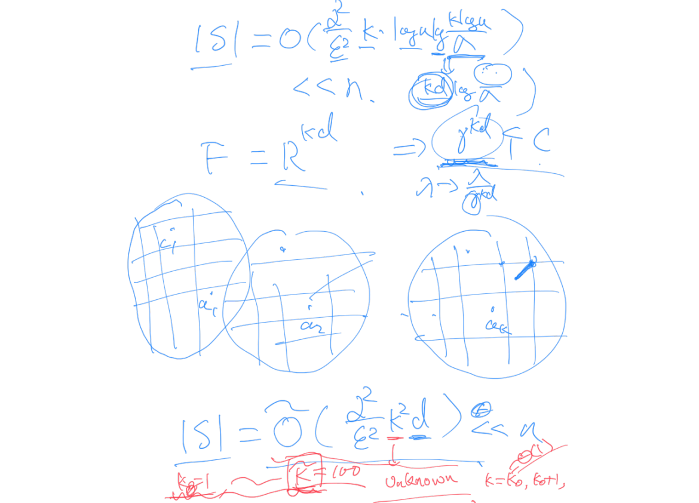

## Coreset

前面很多方法考虑的是压缩维度, 如 PCA, JL 等. 而考虑压缩数据量的有主要是 sampling(uniform or non-uniform).

**Coreset** 考虑的是压缩数据量. 

[toc]

### Definition of Coreset

对 $\epsilon \in (0,1)$, $S \subseteq R^d$ 是 $P$ 的一个 $\epsilon$-coreset, 如果 $|S| \ll n$, $\forall C\in F$ ($F$ 是对应解空间), 有
$$(1-\epsilon)f(P,C) \le f(S, C) \le (1+\epsilon) f(P,C)$$

例如我们有一个对 $f$ 的 $\lambda$ 倍近似比的算法. 如果对 $S$ 运行这个算法, 得到 $C^*$, 那么对于 $P$, $C^*$ 的近似比如下求出:  
令 $C_{opt}$ 是对 $P$ 的最优解, 则由于:
1. $f(S,C^*) \le \lambda f(S, C_{opt})$
2. $f(S, C_{opt}) \le (1+\epsilon) f(P, C_{opt})$
3. $f(S, C^*) \ge (1-\epsilon) f(P, C^*)$

可得 $f(P, C^*) \le \frac{1+\epsilon}{1-\epsilon}\lambda f(P, C_{opt})$

### Coreset for K-means

#### K-means Revisit

K-means 的目标是
$$\mathtt{minimize}:\ \frac{1}{n}\sum\limits_{i=1}^n\min \|p_i-c_j\|^2$$

并设 $\{c_1,c_2,\cdots, c_k\} \subseteq \mathbb{R}^d$ 是其解.

#### 对于 K-means 的 Coreset 构造

##### 分析

若做 Uniform Sample 得到 $S \subset \mathbb{R}^d$, 可以在 $S$ 上得到 $\{c_1', c_2',\cdots,c_j'\} \subseteq \mathbb{R}^d$, 满足下式为 S 上的最优目标函数值:
$$\frac{1}{n}\sum\limits_{i=1}^n \min\limits_{1\le j \le k} \|p_i - c_j'\|^2$$

考虑一个简单的情况: 若 $k=2$, 考虑 $n-1$ 个点集中在一处, 剩余 $1$ 个点在另一远处, 则 $cost_{opt}=0$. 若 $S$ 是随机采样出来的且满足 $|S|=\sqrt{n}$, 则错误出簇中心(即未能选中远处的那 1 个点)的概率为:
$$1-\left(\frac{n-1}{n}\right)^{\sqrt{n}}=1-\left[\left(\frac{n-1}{n}\right)^{n}\right]^{\frac{1}{\sqrt{n}}}\rightarrow 1-\left[\frac{1}{e}\right]^{1/\sqrt{n}}\rightarrow0$$

需要采样 $\sqrt{n}$ 才够, 太多了.

#### 对于 K-median 的 Coreset 构造

##### 算法

1. 用一个 cheap 的算法得到一个粗糙的结果(如 K-means++, $\Theta(\log k))$, 其具有 $\alpha$-approx 的解. 设这个解为 $A=\{a_1,\cdots,a_k\}$
2. 对空间划分.
$\forall a_j$, 划分 $\phi = \log_2(\alpha n)$ 层, $R=\frac{1}{\alpha}f(P,A)$, 即:
    - 第 0 层: $Ball(a_j, R)$, 包含点集 $N_j^0$
    - 第 1 层: $Ball(a_j, 2R)\backslash Ball(a_j, R)$, 包含点集 $N_j^1$
    - ...
    - 第 $\phi$ 层: $Ball(a_j, 2^{\phi}R)\backslash Ball(a_j, 2^{\phi-1}R)$, 包含点集 $N_j^\phi$
    这样设置 $\phi$ 和 $R$ 的原理见下[参数设置的原因](#参数设置的原因)
3. 采样. 从 $N_j^0, \cdots, N_j^\phi$ 中分别均匀采样出 $S_j^0, \cdots, S_j^\phi$, 每层采样 $x$ 个点.(见[$x$ 的确定](#x-的确定))
    $\forall P_i \in S_j^l$, 有 $w(P_i) = \frac{\|N_j^l\|}{x}$, 故 $w(S_j^l) = x \cdot \frac{\|N_j^l\|}{x} = \|N_j^l\|$
4. 输出 $S = \bigcup\limits_{j=1}^k \bigcup\limits_{t=0}^\phi S_j^t$ 为所找到的 coreset.

##### 参数设置的原因

讨论 $P_{i_0}$ 是否在 $\bigcup\limits_{j=1}^k Ball(a_j, 2^\phi R)$ 内.

如果 $\exists P_{i_0} \notin \bigcup\limits_{j=1}^k Ball(a_j, 2^\phi R)$, 因为
$$\begin{aligned}
2^\phi R &= \alpha n \frac{1}{\alpha}f(P,A) \\
&= n\cdot f(P,A) \\
&= \sum\limits_{i=1}^n \min\limits_{1 \le j \le k} \|P_i - a_j\|
\end{aligned}$$
故 
$$\min\limits_{1 \le j \le k} \|P_{i_0} - a_j\| > 2^\phi R = \sum\limits_{i=1}^n \min\limits_{1 \le j \le k} \|P_i - a_j\|$$

一个项就已经超过了, 矛盾. 因此 $P_{i_0} \in \bigcup\limits_{j=1}^k Ball(a_j, 2^\phi R)$

##### $x$ 的确定

显然有 $|S|=k \times (\phi+1) \times x = O(k\log(\alpha n) x)$

Fix $N_j^t$, Fix $C=\{c_1,\cdots,c_k\}$

考虑 $P_i, P_{i'} \in Ball(a_j, 2^{t}R)\backslash Ball(a_j, 2^{t-1}R)$
记 $g(P_i, C) = \min\limits_{1\le j\le k}\|P_i - c_j\|$

不妨令 $g(P_i, C) = \|P_i - c_1\|$, $g(P_{i'}, C) = \|P_{i'} - c_2\|$

则 $\|P_i - c_1\| \le \|P_i - c_2\| \le \|P_i - P_{i'}\| + \|P_{i'} - c_2\|$
从而 $\|P_i - c_1\| - \|P_{i'} - c_2\| \le 2^{t+1}R$
同理 $\|P_{i'} - c_2\| - \|P_{i} - c_1\| \le 2^{t+1}R$
合起来即
$$\left| g(P_i, C) - g(P_{i'}, C) \right| \le 2^{t+1}R$$

对于 $N_j^t$, 每一个 $g(P_i, C)$ 都可以看作一个独立的随机变量

那么 $|N_j^t|$ 个随机变量 $\in [z, z + 2^{t+1}R]$, 由 Hoeffding 不等式可以估计 $x$:

若 $x = \frac{1}{\epsilon_0^2}\log\frac{1}{\lambda}$, 其中 $\epsilon_0 \in (0,1)$, $\lambda \in (0,1)$, 则以 $Prob > 1-\lambda$ 有:
$$\left| \frac{1}{x}\sum\limits_{p \in S_j^t}g(p, C) - \frac{1}{|N_j^t|}\sum\limits_{p \in N_j^t} g(p, C) \right| \le \epsilon_0 \cdot 2^{t+1}R$$
这等价于
$$\left| \frac{|N_j^t|}{x}\sum\limits_{p \in S_j^t}g(p, C) - \sum\limits_{p \in N_j^t} g(p, C) \right| \le \epsilon_0 \cdot 2^{t+1}R|N_j^t|$$

现在考虑近似比:

$|f(S,C)-f(P,C)|$ 应当 $\le \epsilon f(P,C)$

需要考虑的 $N_j^t$ 中, $j=1, \cdots, k$, $t = 0, \cdots,\phi$, 故有(下面忽略了t=0是个球, 近似地写)

$$\begin{aligned}
|f(S,C)-f(P,C)| &= \left| \sum\limits_{j=1}^k\sum\limits_{t=0}^\phi \sum\limits_{p\in S_j^t} \frac{|N_j^t|}{x} g(p, C) - \sum\limits_{j=1}^k\sum\limits_{t=0}^\phi\sum\limits_{p\in N_j^t}g(p,C) \right| \\
&\le \sum\limits_{j=1}^k\sum\limits_{t=0}^\phi \left| \sum\limits_{p\in S_j^t} \frac{|N_j^t|}{x} g(p, C) - \sum\limits_{p\in N_j^t}g(p,C) \right| \\
&\le \sum\limits_{j=1}^k\sum\limits_{t=0}^\phi \epsilon_0 \cdot 2^{t+1}R|N_j^t| \\
&\le \sum\limits_{j=1}^k\sum\limits_{t=0}^\phi \epsilon_0 \cdot 4\cdot \sum\limits_{p\in N_j^t}\|p-a_j\| \\
&\le 4\epsilon_0 f(P,A)\\
&\le 4\alpha\epsilon_0 f(P, C_{opt}) \\
&\le 4\alpha\epsilon_0 f(P, C)
\end{aligned}$$

令 $\epsilon_0=\frac{\epsilon}{4\alpha}$, 则上式 $\le \epsilon f(p,C)$ 满足近似比.

从而知 $x=O(\frac{1}{\epsilon_0}\log\frac{k\log n}{\lambda})=O(\frac{\alpha^2}{\epsilon}\log\frac{k\log n}{\lambda})$

检验一下 $|S|$ 的量级:
$$|S|=O(\frac{\alpha^2}{\epsilon}\log\frac{k\log n}{\lambda} \times k\times \log n) \ll O(n)$$

> 下面这个部分没看懂在干嘛
> 

#### 应用于分布式计算的 Coreset

主要是降低通信复杂度.

令 $P=P_1\cup\cdots P_m$, 分别采样出 $S=S_1\cup\cdots\cup S_m$, 分别做算法得到:

- $S_1 \sim f(P_1, A_1)$, $\frac{\epsilon}{\alpha} |P_1| f(P_1, A_1)$
- $S_2 \sim f(P_2, A_2)$, $\frac{\epsilon}{\alpha} |P_2| f(P_2, A_2)$
- ...
- $S_m \sim f(P_m, A_m)$, $\frac{\epsilon}{\alpha} |P_m| f(P_m, A_m)$

则
$$总体误差 \le \sum\limits_{l=1}^m \frac{\epsilon}{\alpha} |P_l| f(P_l, A_l) \le \epsilon n f(P, C_{opt})$$

找 k-means 和 k-median 的 $k$ 可以按照 $k = 1, 2, 2^2, \cdots, 2^t, $ 来倍增地找.

建 $\log \widetilde{k}$ 次 coreset

