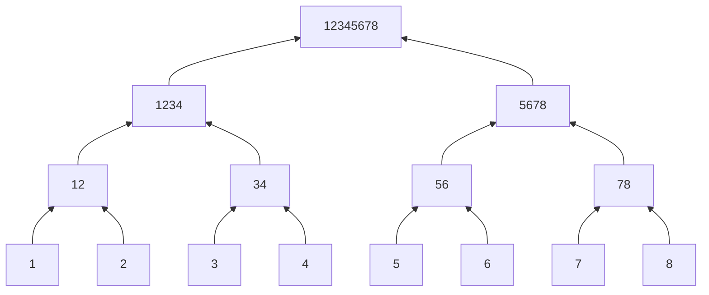

## Stream Algorithm

[toc]

### 蓄水池抽样

#### 单样本
从 $a_1,\cdots, a_m$ 中均匀概率抽样 $a_i$ ($m$ 的值可能不知道)

可以:
1. $x=a_1$
2. 对第 $t$ 个: 
    - $x$ 不变概率为 $1-\frac{1}{t}$
    - $x \rightarrow a_t$ 概率为 $\frac{1}{t}$

**Porf**:
归纳法

#### 多样本

若要取样 $k$ 个, 可以:
1. 初始 $V=\{a_1, a_2,\cdots,a_k\}$,
2. 对第 $t$ 个: 
    - 放弃 $a_t$ 不变概率为 $1-\frac{k}{t}$
    - $a_t \rightarrow V$ 概率为 $\frac{k}{t}$, 并以 $\frac{1}{k}$ 概率从 $V$ 中删去

**Prof**:
1. 对于 $t \le k$, $\forall a_i\ in V \sim 1$
2. 若 $t=t_0$, $\forall a_i \in V \sim \frac{k}{t}$
且对 $t=t_0 + 1$, $a_t \in V \sim \frac{k}{t}$,
$\forall 1 \le i \le t_0, a_i \in V \sim \frac{k}{t_0}\cdot(1-\frac{k}{t}+\frac{k}{t}\frac{k-1}{k})$

### 最高频率值

Input: $a_1,\cdots, a_m$, $\forall a_i \in [0,n]$,
Output: $\{0,1,\cdots, n\}$ 中在数据流出现频率最高的值.

假设最高频值至少出现 $\frac{m}{2}$ 次.

方法1:
1. 采样 $k$ 个. 则有 $>1-(\frac{1}{2})^k>1-\delta$ 的概率找到最大值
2. 再过一个 pass, 统计 candidates 的数目.

其空间是 $space=k\cdot \log n+k\log m = k(\log n+\log m)=\log\frac{1}{\delta}(\log n+ \log m)$

方法2:
1. 有一个 $counter$ $C$, $x$ 为存储的值. 初始 $x=a_1$, $C=1$
2. 读 $a_t$,
    - 若 $a_t=x$, 则 $C=C+1$
    - 若 $a_t\not=x$, 则 $C=C-1$
    - 若 $C=0$, $x=a_t$, $C=1$

**证明**:
**按 m 归纳法, 待补充(注意考虑奇偶问题)**

### 近似求值的频率

Input: $a_1,\cdots, a_m$, $\forall a_i \in \{0, 1,\cdots, n\}$,
Output: $\forall j \in \{0,1,\cdots, n\}$, $f_j$ 表示 $j$ 的频率.

放松要求, 不用精确值. 输出 $\hat{f}_j$ 满足 $f_j - \epsilon m \le \hat{f}_j \le f_j + \epsilon m$

如果 $f_i\le \epsilon m \Rightarrow \widetilde{f}_i=0$, 

只需考虑 $f_j > \epsilon m$ 的情况, 最多 $\frac{1}{\epsilon} - 1$ 个

$\sum\limits_{j=1}^n f_j = m$

#### Misra-Gries Algorithm

原本求最高频率值用的是一个 counter, 这边用多个.

令 $k=\frac{1}{\epsilon} - 1$, 
内存: $C[1], C[2], \cdots, C[k] = 0$, $X[1], X[2], \cdots, X[k] = 0$

从 $t=1$ 到 $m$:
- 如果 $\exists X[s] = a_t$: $C[s]=C[s] + 1$
- 否则:
    - 如果 $\exists C[s]=0$, $X[s]=a_t, C[s]=C[s]+1$
    - 如果 $\not\exists C[s]=0$, $\forall s=1,2,\cdots,k$, $C[s]=C[s]-1$

输出: 对于 $\forall X[s], \hat{f}_{X[s]}=C[s]$, 对于其他值 $j$, $\hat{f}_j=0$

空间需要 $space=k(\log m + \log n)$, $k=\frac{1}{\epsilon} - 1$

##### Example

$n = 3$, $\{0,1,2,3\}$, $m = 14$, $\epsilon = 0.3$, 则可令 $k=3$
Input: $\{0,1,1,1,2,0,1,2,2,0,3,3,0,1\}$

||||
|:-|:-|:-|:-|
|id|C|X|
|1|3|0|
|2|4|1|
|3|3|2|
||||

然后读了两次 3:
||||
|:-|:-|:-|:-|
|id|C|X|
|1|1|0|
|2|2|1|
|3|1|2|
||||
然后继续:
||||
|:-|:-|:-|:-|
|id|C|X|
|1|2|0|
|2|3|1|
|3|1|2|
||||

Output: $\hat{f}_0=2, \hat{f}_1=3, \hat{f}_2=1,\hat{f}_3=0$
而真实值是 $f_0=2, f_1=3, f_2=1,f_3=0$, 差距不超过 $\epsilon m \approx 4.2$

##### 算法性质证明

即证明 $$f_j - \epsilon m \le \hat{f}_j \le f_j + \epsilon m$$

上界显然一定成立. 因此下面考虑下界.

- case 1: $j$ 出现在对应的 Label $\{X[1],\cdots,X[k]\}$里.
    $\# Deletion \le \frac{m}{k}=\frac{m}{\frac{1}{\epsilon}}$, 
    因此 $\widetilde{f}_j \ge f_j - \frac{m}{\frac{1}{\epsilon}} = f_j - \epsilon m$
- case 2: $j \notin \{X[1],\cdots,X[k]\}$, 则要证明 $f_j\le \epsilon m$
    反证: 如果 $f_j > \epsilon m$, 就必然出现在里面**TODO**, 不会发生.

##### 复杂度分析

- 时间: 只需要 1 pass
- 空间: 只要保留 k 个 counter 和 label, 因此只需要 $k(\log m + \log n)=\Theta\left(\frac{1}{\epsilon}(\log m + \log n)\right)$

#### Count-Min Sketch

该算法能够概率给出精确下界和不精确上界.
**Input**: $\{a_1,a_2,\cdots,a_m\}$, $\forall a_j\in\{0,1,\cdots,n\}$.

构造 $t$ 个 Hash Function: $h_1,\cdots, h_t$, $\forall h_j: [n]\rightarrow [k]$, $k=\frac{2}{\epsilon}$.
> $[n]$ 表示 1 到 n

对每个 Hash Function 建立 $k$ 个 Counter:

$h_1: C_{11}, \cdots, C_{1k}$
$\vdots$
$h_t: C_{t1}, \cdots, C_{tk}$

```julia
for i = 1 ~ m
    for j = 1 ~ t
        C[j, h[j](a[i])] = C[j, h[j](a[i])] + 1
    end
end
```

每个新的值都会让每行有一个 Counter + 1, 因此结束后每行 counter 之和为 $m$

**Return**: 对 $\hat{f}_j$, 只要返回 $\forall i$ $C_{i,h_i(j)}$ 中最小值

##### 例子

k=4, t=3, m=20
$$
\begin{aligned}
\left[\begin{array}{cccc}
7 & 7 & 2 & 4 \\
3 & 0 & 5 & 12 \\
9 & 1 & 1 & 9 \\
\end{array}\right]
\end{aligned}$$

对于 $\hat{f}_3$, 考虑若 $h_1(3)=2, h_2(3)=4, h_3(3)=3$, 对应表中 7, 12, 1, 其中中最小的是 1, 因此 $\hat{f}_3=1$

##### 界的证明

- **下界** $\hat{f}_q \ge f_q$, 这里 $\hat{f}_q=\min\limits_{1\le j \le t} C_{j h_j(q)}$. 这等价于 $\forall 1 \le j \le t, C_{j h_j(q)} \ge f_q$. 因为如果真的出现了 q, 一定会加 1, 所以下界肯定成立.

- **上界** Fix q, $j\in\{1,\cdots, t\}$, $h_j: \{0,\cdots,n\} \rightarrow \{1,\cdots, k\}$, 肯定有一个这样的映射关系: $q \rightarrow h_j(q)$.
但也可能 $\exists q' \not= q, h_j(q') = h_j(q)$, 概率是 $\frac{1}{k}$ (这里假设都是随机的, 并且 $h_j(q)$ 已经固定下来)
所以 $C_{jh_j(q)}$ 错加的概率是 $\frac{1}{k}$, 总共错加的期望是 $$\sum\limits_{q'}\frac{1}{k}f_{q'}=\frac{1}{k}\sum\limits_{q'}f_{q'} \le \frac{1}{k}m=\frac{1}{2}\epsilon m$$
由 Markov 不等式:
$$Pr[C_{jh_j(q)} 错加 \le \epsilon m] \ge \frac{1}{2}$$
那么对于 $\forall j = \{1,2,\cdots,t\}$, $\exists j_0, C_{j_0 h_{j_0}(q)} \cdots \le \epsilon m$ 的概率 $\ge 1 - \left(\frac{1}{2}\right)^t$
让 $t=\log\frac{1}{\delta}$, $\delta \in (0,1)$
$\Rightarrow \min\limits_{1\le j \le t} C_{jh_j(q)} > f_q + \epsilon m$ 的概率 $< \left(\frac{1}{2}\right)^t = \delta$

##### 复杂度分析

- 时间: 1 pass
- 空间: $t\times k$ 的矩阵, 每个 counter 不超过 $\log m$; 此外还要存储哈希方程, 每个至少是 $\log n$, 一共 $t$ 个. 因此是 $\Theta(\log\frac{1}{\delta} \cdot \frac{2}{\epsilon} \cdot \log m + \log\frac{1}{\delta} \cdot \log n)$;

> 关于哈希方程的空间复杂度: $\{0,1,\cdots, n\} \rightarrow \{1,2,\cdots,k\}$, 可能有多重取 mod, 要保证随机性就需要一个大质数 $p=\Theta(n)$. 实际操作做哈希的时候都是哈希函数族, 不会只有一个. 会从族中随机取一个
**没懂((((**

##### 优点

- 比起第一种方法, 这种方法是不断地加的, 它适合动态分析, 比如有错的, 要减掉, 直接减就行, 但如果是前面那方法可能已经抹掉了, 不能随便减.

### Coreset Streaming

Input: P,f(P, C)
Coreset: $P \Rightarrow S$, $|S| \ll P$, s.t.
$$\forall C f(S,C) \in (1 \pm \epsilon) f(P,C)$$

非流情况: 开始的得到粗糙解要 (比如 k-means++) 扫数据集 k 遍, 不断放大环需要至少 2 遍(用上蓄水池采样？)

能不能扫一遍就做到?

#### 两个关于 Coreset 的性质

1. 如果 $S_1$ 是 $P_1$ 的 $\epsilon-coreset$, $S_2$ 是 $P_2$ 的 $\epsilon-coreset$, 则 $S_1\cup S_2$ 是 $P_1\cup P_2$ 的 $\epsilon-coreset$p
> Hank: 这个东西怎么在线性回归中体现? 想想不太出来
2. 若 $S_1$ 是 $S_2$ 的一个 $\epsilon_1-coreset$, $S_2$ 是 $S_3$ 的一个 $\epsilon_2-coreset$, 则 $S_1$ 是 $S_2$ 的 $\epsilon_1+\epsilon_2+\epsilon_1\epsilon_2-coreset$, 近似简化成 $(\epsilon_1+2\epsilon_2) -coreset$
证明: $f(S_1,C) \in (1\pm\epsilon_1)f(S_2,C)$, $f(S_2,C) \in (1\pm\epsilon_2)f(S_3,C)$, 故
$$f(S_1,C) \in (1\pm\epsilon_1)(1\pm\epsilon_2)f(S_3,C)$$
从而得到 $\epsilon$

#### 算法

假设有一些桶:
|||||||||
|:-|:-|:-|:-|:-|:-|:-|:-|
顺序装数据.



**Merge Reduce**: 如果第 1, 2 个桶满了, 就合并, size 变成 $2\times\frac{m}{8}$, 如果第 3, 4 个桶满了, 就也合并. 如果 $12$ 和 $34$ 都合并出来了, 就合并成 $1234$.
它的性质是, 每个时刻, 每一层最多两个桶

每个桶分配 $\Theta(1)$, 树高 $\Theta(\log m)$, 每个时刻最多只需要保留 $2\cdot \log m$ 个桶(也就是 $\Theta(\log m)$)

**考虑每次合并的时候取 coreset 保留, 那么最终树根就是整个数据集的 coreset.**

最终顶层输出的是 $(\epsilon\cdot\log m)$-coreset, 这可能很大, 所以一开始如果要满足 $\epsilon$ 的结果, 要求把 $\epsilon \rightarrow \frac{\epsilon}{\log m}$.

常规的 coreset size: $\Theta(\frac{k^2d}{\epsilon^2}\log n)$
Merge-Reduce: 内存 $\Rightarrow \Theta(\frac{k^2d}{\epsilon^2}\log^3 n)$
> 复杂度计算见 paper


